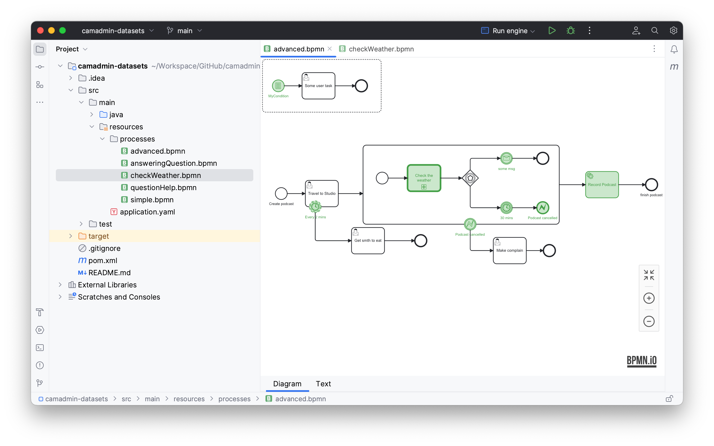

# BPMN 2.0 Plugin for IntelliJ IDEA

    

<!-- Plugin description -->

The BPMN2 Plugin is a helpful tool for reviewing BPMN (Business Process Model and Notation) diagrams directly within the code editor of IntelliJ IDEA. This plugin enhances the development experience by providing visual representations of BPMN diagrams and facilitating easy navigation and analysis.

## Features

- Interactive Diagram Viewer: Visualize BPMN diagrams with interactive elements such as zooming, panning, and tooltips for enhanced readability.
- Navigation: Seamlessly navigate between code and BPMN diagrams using intuitive navigation features.
- Syntax Highlighting: Highlight BPMN-specific syntax in code as XML files for better code comprehension and identification of BPMN elements.
- Dark mode: For your enjoyment of code
<!-- Plugin description end -->

## Code of Conduct

Everyone interacting in the Camadmin project’s codebases, issue trackers, chat rooms, and mailing lists is expected to follow the [contributor code of conduct](https://github.com/rubygems/rubygems/blob/master/CODE_OF_CONDUCT.md).

## License

This plugin is released under the [MIT License](LICENSE).

[template]: https://github.com/JetBrains/intellij-platform-plugin-template
